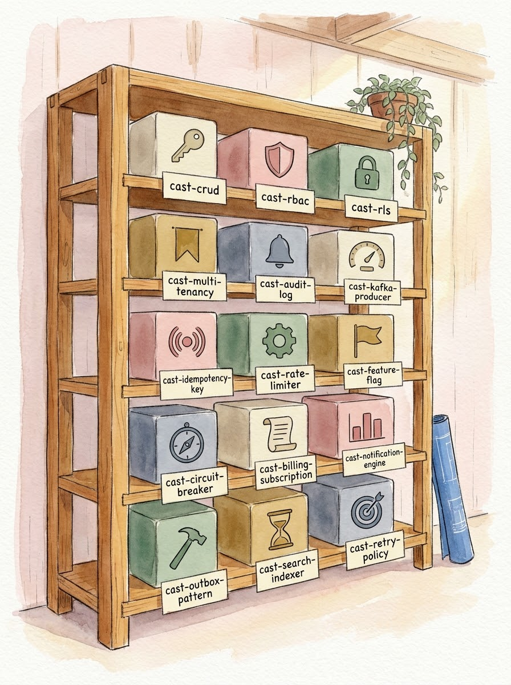
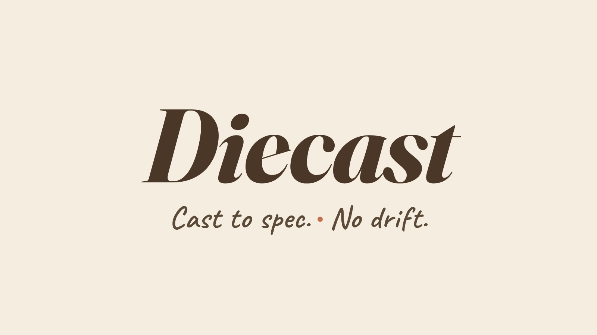

<div align="center">



<br/>



### Cast from the same die. Every run.

**Opinionated agents, cast to spec from a die you control.**

[](LICENSE)
[](#status)
[](https://github.com/sridherj/diecast/discussions)

</div>

---

## What is Diecast

Diecast is an opinionated workflow runtime for AI-assisted development on Claude Code. It ships:

- **Layer-1 — opinionated agents** (`cast-*`) cast from a spec, paired with checkers. Every run produces the same shape. No drift.
- **Layer-2 — a workflow chain** that decomposes a goal, researches it, plans it, runs it, and reviews it — with parent-child delegation that works whether or not you run the local server.

If you've been duct-taping prompts and per-repo `.claude/agents/` files together, Diecast is the convention you wish you'd written. If you've built your own harness on top of Claude Code, Diecast is what you'd ship if you had time to clean it up.

---

## Why this exists

Three things keep biting senior engineers shipping with AI:

1. **AI writes correct code, but not the way you would.** You lose the intuition to reason about your own codebase.
2. **Junior-member output explodes PR volume.** Manual review breaks. The codebase becomes a black box.
3. **AI still can't do large, opinionated tasks the way you want.** Every RBAC-style integration needs heavy up-front spec'ing.

Diecast doesn't fix the model. It fixes the workflow around the model.

- The **maker-checker pattern** is the reliability mechanism — every maker ships paired with a checker that validates the output.
- The **workflow chain** is what makes opinionated agents composable instead of one-offs.
- The **parent-child delegation primitive** lets a single chain step spawn and supervise sub-tasks without a brittle prompt.

---

## Quick start

```bash
# 1. Clone
git clone https://github.com/sridherj/diecast.git
cd diecast

# 2. Install (drops cast-* skills + agents into ~/.claude/, links the repo as ~/.claude/skills/diecast/, and starts cast-server on first install)
./setup

# 3. In any project, scaffold the docs/ structure Diecast writes into
cd ~/your-project
/cast-init

# 4. Refine a requirement, plan it, run it
/cast-refine
/cast-high-level-planner
/cast-orchestrate
```

That's the chain. Every step writes its artifact into `docs/` using a stable file convention; every step suggests the next command.

### Run the server

`./setup` starts cast-server in the background and opens the dashboard on first
install. To start it again after a reboot or shell restart:

```bash
~/.claude/skills/diecast/bin/cast-server                            # http://localhost:8005
./bin/cast-server                                                   # equivalent, from a fresh clone
CAST_PORT=8080 ~/.claude/skills/diecast/bin/cast-server             # custom port (8005 is the default)
CAST_BIND_HOST=0.0.0.0 ~/.claude/skills/diecast/bin/cast-server     # server-side bind for LAN access
CAST_HOST=cast.example.com ~/.claude/skills/diecast/bin/cast-server # client-side connect target (future cloud)
```

cast-server is a single user-level daemon — one instance per machine, shared
across every project you cd into. State lives in `~/.cast/diecast.db`; logs at
`~/.cache/diecast/server.log` (bootstrap output at `bootstrap.log`).
`CAST_HOST` / `CAST_PORT` are the *client-side* connect target (used by skills
calling the server); `CAST_BIND_HOST` controls the *server-side* bind. Each
goal binds to one repo via its `external_project_dir` column.

Diecast does not put anything on your `$PATH`. `./setup` symlinks the repo to
`~/.claude/skills/diecast/`, so `~/.claude/skills/diecast/bin/cast-server` and
`~/.claude/skills/diecast/bin/cast-hook` are the canonical entry points (alias
in your shell rc if you want a shorter name). Every other Diecast operation is
a `/cast-*` slash command inside Claude Code (run `/cast-doctor` to diagnose,
`/cast-init` to scaffold, `/cast-runs` for the dashboard, etc.).

---

## What you get

### The workflow chain (Layer-2)

A composable sequence of opinionated `cast-*` skills, each writing a known artifact and handing off to the next:

```
/cast-refine            →  docs/requirement/<goal>_refined_requirements.collab.md
/cast-goal-decomposer   →  docs/exploration/<goal>/decomposition.ai.md
/cast-explore           →  docs/exploration/<goal>/research.ai.md  (+ playbooks)
/cast-high-level-planner→  docs/plan/<date>-<goal>.collab.md
/cast-detailed-plan     →  docs/plan/<date>-<goal>-phase-N.collab.md  (auto-triggers /cast-plan-review)
/cast-orchestrate       →  docs/execution/<goal>/<phase>/...
```

Every artifact is markdown. Every step is invokable on its own. Drop in at the level you need.

### Parent-child delegation, server or no server

Any `cast-*` agent can spawn a child agent. The child writes its result to a contract-versioned `.agent-run_<RUN_ID>.output.json`. The parent polls the file in a loop until done. **You don't need to run cast-server for this to work** — the file-based contract is canonical; the server is a read-through.

If you do run `cast-server`, you get:

- A local web UI at `http://localhost:8005` for goals / tasks / runs
- The HTTP API for richer dispatch state
- Rate-limit auto-restart on Claude API throttling
- Concurrent-children cap so the dispatcher behaves under load

### File conventions, codified

Diecast doesn't ask you to remember the conventions. `/cast-init` writes a project-local `CLAUDE.md` that tells every cast-* agent where to write what. Authorship suffixes (`.human.md`, `.ai.md`, `.collab.md`), date prefixes for plans, version suffixes for iterations, `<goal_name>` folder vs flat-name heuristic — all documented, all enforced.

### CC-time-aware estimates

Tasks generated by `cast-task-suggester` are sized for **Claude Code as the executor**, not human-hours. T-shirt sizes (XS / S / M / L / XL) calibrated to wall-clock CC time and token cost. Anything ≥ L gets a "consider splitting" affordance.

### Next-command suggestions

Every cast-* step ends with 1–3 suggested next commands grounded in what you just produced. Chain commands surface them automatically; terminal commands ask first. Configurable in `~/.cast/config.yaml`.

---

## Installation

### Prerequisites

- [Claude Code](https://claude.com/claude-code) installed and authenticated
- Python 3.11+
- `uv` (`curl -LsSf https://astral.sh/uv/install.sh | sh`)
- Git

### Setup

```bash
git clone https://github.com/sridherj/diecast.git
cd diecast
./setup
```

`./setup` installs:

- `~/.claude/agents/cast-*` — all agent definitions
- `~/.claude/skills/cast-*` — all slash commands (skills are auto-generated; never hand-edit)
- `~/.claude/skills/diecast/bin/cast-server` symlinked from the repo (no PATH pollution)
- `~/.cast/config.yaml` — your local config

Re-run `./setup` any time; existing files back up to `~/.claude/.cast-bak-<timestamp>/` first.

### Upgrade

```bash
/cast-upgrade
```

Detects new versions, asks before upgrading, **stashes your local skill modifications** so a `git pull` doesn't silently overwrite tweaks. If the upgrade fails, restores from `.bak` automatically. Snooze with escalating backoff if you're not ready.

---

## The two layers

### Layer-1 — opinionated agents (`cast-*`)

Cast from a spec. Paired with a checker. Same input shape → same output shape. Every run.

The reference Layer-1 module shipped at v1 is the **`cast-crud` family** — a maker chain (`cast-crud-orchestrator`, `cast-schema-creation`, `cast-entity-creation`, `cast-repository`, `cast-service`, `cast-controller`) plus `cast-crud-compliance-checker` and the test makers/checkers. Read [`docs/maker-checker.md`](docs/maker-checker.md) to see the pattern end-to-end.

### Layer-2 — workflow / orchestration

The chain that turns "I have a goal" into "the work shipped."

```
refine → decompose → explore → playbook → plan → detailed-plan → orchestrate → subphase-runner
                                                                  ↑              ↑
                                                          delegates to       delegates to
                                                          cast-plan-review   cast-review-code
                                                          (auto)             (for coding tasks)
```

Layer-2 is what makes Layer-1 shippable across teams. Without it, opinionated agents are one-offs that work only in their author's repo.

---

## Status

**Alpha — v1.0 launch.** Currently shipping:

- ✅ Workflow chain (Layer-2) — refine, decompose, explore, planner, detailed-plan, orchestrate, subphase-runner, plan-review
- ✅ Parent-child delegation (server-mode + serverless file-contract mode)
- ✅ Presentation pipeline (narrative → what → how → assembler with quality gates)
- ✅ Goals / tasks / runs CRUD via cast-server
- ✅ `cast-crud` reference family (maker-checker walkthrough)
- ✅ `/cast-init` project scaffolding + file conventions
- ✅ `/cast-upgrade` with local-mod preservation

**Not yet shipped (see [ROADMAP.md](ROADMAP.md)):**

- v1.1 — Agent contracts schema, opt-in install telemetry
- v1.2 — Evals harness for cast-* agents
- v2 — PM-tool adapters (Linear / Jira / GitHub Issues), multi-harness support (Codex / Copilot)

---

## Project layout

```
diecast/
├── README.md
├── LICENSE                       # Apache-2.0
├── VERSION
├── setup                         # one-command installer
├── bin/
│   ├── generate-skills           # generates ~/.claude/skills/cast-*/SKILL.md
│   └── cast-server               # CLI entrypoint
├── agents/                       # cast-* agent definitions
├── skills/claude-code/           # cast-* slash commands (canonical sources)
├── cast-server/                  # FastAPI app + Jinja UI + dispatcher
│   ├── app/
│   ├── templates/                # Diecast design tokens applied
│   └── static/
├── templates/                    # cast-spec.template.md, cast-plan.template.md
├── migrations/                   # /cast-upgrade migration scripts (empty at v1)
├── docs/                         # this project's own docs (incl. GitHub Pages site)
└── examples/                     # cast-crud walkthrough, etc.
```

---

## Contributing

Diecast is built around opinionated agents — but the opinions are open to challenge. Good contributions:

- New `cast-*` agents that ship with checkers and example outputs
- Fixes that improve the chain's robustness across non-author repos
- Anonymized real-world feedback on the chain ("here's where it broke for me")

Read [CONTRIBUTING.md](CONTRIBUTING.md) before opening a PR. Discussion happens in [GitHub Discussions](https://github.com/sridherj/diecast/discussions).

---

## License

[Apache License 2.0](LICENSE)

---

<div align="center">

<sub>Diecast harvested patterns from <a href="https://github.com/github/spec-kit">spec-kit</a> (templates) and gstack (upgrade flow).</sub>

</div>
